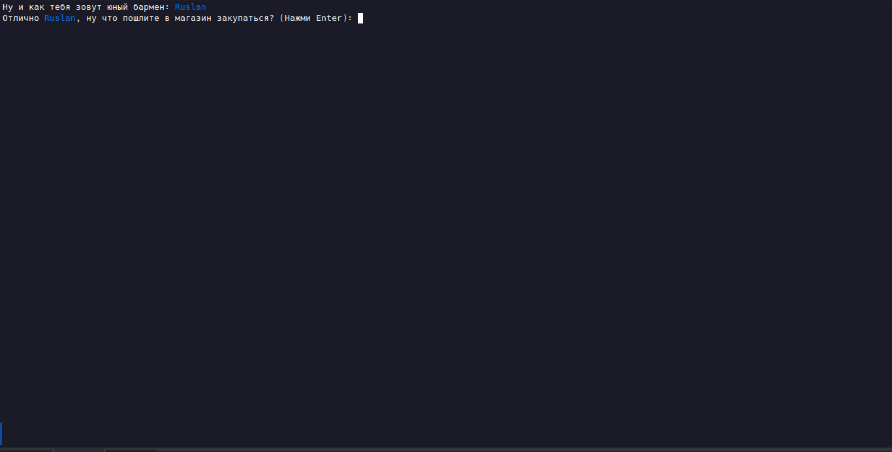

# Simulator barman "Foobarman" (cli-game)

<p align="center">
  
</p>

## Run and build

run: ```go run ./cmd/app```
build: ```go build -o ./foobarman ./cmd/app``` 

## Description

Welcome, this repo with cli-game that show what its like to be a bartender <br>
and maybe even teach you somthing else.

All control on the command line - hints are present.

Look, if you want playing this game, <br>
then run execute file called like "foobarman" (linux) or "foobarman.exe" (windows) <br>

First thing you need to do its select name for your bartender. <br>
Second thing its shoping in the store, choose the right ingredients, you only have three hundred bucks. <br>
And now the real game begins... 


### Screenshots

<p align="center">
  
</p>
<p align="center">
  
</p>
<p align="center">
  
</p>

> TODO later there will be more screenshots and more detailed instructions for the game.

## References

Most of the information is taken from open sources. In particular from the sites:
- https://ru.inshaker.com (most cocktail recipes, their description and description of drinks)
- https://drizly.com (Most drinks, their prices and thier descriptions)

## Technical information

Game version: 0.2.6 <br>
Main development language: Go (Golang) <br>
Golang version: 1.19 <br>
